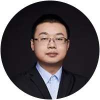

# 2024-09-22

## 活动介绍

讲师：**张善友**

微软最有价值专家、腾讯云 TVP、华为云 HCDE、广东智用人工智能应用研究院有限公司 CTO

从事 .NET 技术开发二十三年，认证 CKAD 专家， 曾在腾讯工作12年，2018年创立深圳友浩达科技，专注于云原生和工业物联网解决方案落地。目前在广东智用人工智能应用研究院担任工业&社区 CTO。业余积极参与运营 .NET 技术社区、 Dapr 中文社区、Semantic Kernel 中文社区 以及相关开源项目，运营微信公众号“dotnet跨平台” 和 “新一代智能应用“。荣获连任19次微软最有价值专家 MVP，6届华为云 HCDE，6届腾讯云最有价值专家 TVP。

主题：**拥抱 AI 的 .NET 9**

在过去大数据、移动互联网时代。.NET 错过了两个时代，但是在云原生和人工智能时代，.NET已经完成脱胎换骨，变得开放又强大，特别是即将到来的 .NET 9，在帮助开发人员构建更智能的应用程序方面有非常大的改进。本次分享 .NET 社区这一年在 AI 方面的新进展。

## 更多

- [活动介绍](https://mp.weixin.qq.com/s?__biz=MzA3NTU4NjY3Mw==&mid=2247498474&idx=1&sn=0bb280750d3c162a233b84c9829172d5&chksm=9ef65b20c1281db42b12ebda8d2929d8da356f17ffbeccbed4b460ee5c755be7b5a48ddf7c8c&scene=126&sessionid=1730733550#rd)
- [视频回放](https://www.bilibili.com/video/BV1X5shecEeE/)
- [讲师 Github](https://github.com/geffzhang)
